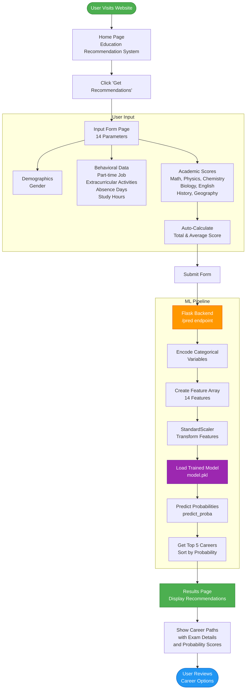

# <div align="center"> 
</div>

<div align="center">


[](https://opensource.org/licenses/MIT)
[](https://github.com/richochetclementine1315/career_suggestion_system/graphs/commit-activity)

**An intelligent ML-powered web application that recommends personalized career paths based on student academic performance, interests, and behavioral patterns.**

[🚀 Demo](#demo) • [✨ Features](#features) • [🛠️ Installation](#installation) • [📖 Usage](#usage) • [🤝 Contributing](#contributing)

</div>

---

## 📋 Table of Contents

- [Overview](#overview)
- [Features](#features)
- [Tech Stack](#tech-stack)
- [System Architecture](#system-architecture)
- [Workflow Diagram](#workflow-diagram)
- [Installation](#installation)
- [Usage](#usage)
- [Model Details](#model-details)
- [Project Structure](#project-structure)
- [API Endpoints](#api-endpoints)
- [Screenshots](#screenshots)
- [Contributing](#contributing)
- [License](#license)
- [Contact](#contact)

---

## 🎯 Overview

The **Career Suggestion System** is an intelligent recommendation platform designed to help students make informed decisions about their career paths. By leveraging machine learning algorithms trained on academic performance data, behavioral patterns, and student interests, the system provides personalized top-5 career recommendations with probability scores.

### 🎓 Problem Statement
Students often struggle to choose the right career path that aligns with their strengths, interests, and academic performance. This system addresses this challenge by:
- Analyzing multi-dimensional student data (7 subjects + behavioral factors)
- Predicting career compatibility using ensemble ML models
- Providing ranked recommendations with confidence scores
- Considering both academic and non-academic factors

### 🎯 Target Audience
- High school students planning for higher education
- University students exploring career options
- Academic counselors and career advisors
- Educational institutions

---

## ✨ Features

### 🔮 Core Capabilities
- **🎓 Personalized Career Recommendations**: Top-5 career paths ranked by suitability with probability scores
- **📊 Multi-Factor Analysis**: Considers 14 input parameters including:
  - 7 subject scores (Math, Physics, Chemistry, Biology, English, History, Geography)
  - Demographic data (Gender)
  - Behavioral patterns (Part-time job, Extracurricular activities)
  - Study habits (Weekly self-study hours, Absence days)
  - Aggregate performance (Total score, Average score)

### 🧠 Machine Learning Features
- **Advanced ML Pipeline**: 
  - SMOTE (Synthetic Minority Over-sampling Technique) for handling class imbalance
  - StandardScaler for feature normalization
  - Ensemble model evaluation (9 algorithms tested)
  - Best performing model deployed (likely Random Forest/XGBoost)
- **17 Career Categories**: Comprehensive coverage including:
  - Medical (Doctor via NEET)
  - Engineering (Software/Construction via JEE, WBJEE, MHT CET)
  - Law (Lawyer via CLAT, AILET)
  - Government Services (UPSC, SSC CGL)
  - Business & Finance (Banker, Accountant, Stock Investor)
  - Creative Fields (Artist via CUET, Designer via CEED, Writer)
  - And more...

### 🎨 User Experience
- **Responsive Web Interface**: Bootstrap 4.5.2 powered responsive design
- **Dynamic Background**: Rotating background images for visual appeal
- **Auto-calculation**: Real-time total and average score computation
- **Clean UI/UX**: Intuitive form-based input with validation

---

## 🛠️ Tech Stack

### Backend
| Technology | Version | Purpose |
|------------|---------|---------|
| **Python** | 3.12 | Core programming language |
| **Flask** | 3.0.4 | Web framework for REST API |
| **Scikit-learn** | 1.5.2 | Machine learning algorithms |
| **XGBoost** | 2.1.2 | Gradient boosting classifier |
| **Pandas** | 2.2.3 | Data manipulation and analysis |
| **NumPy** | 2.1.3 | Numerical computing |
| **imbalanced-learn** | 0.12.4 | SMOTE implementation |
| **Pickle** | Built-in | Model serialization |

### Frontend
| Technology | Purpose |
|------------|---------|
| **HTML5** | Structure and semantics |
| **CSS3** | Styling and animations |
| **JavaScript (ES6)** | Client-side interactivity |
| **Bootstrap 4.5.2** | Responsive UI framework |

### Development Tools
- **Jupyter Notebook**: Model development and experimentation
- **Git**: Version control
- **Virtual Environment**: Dependency isolation

---

## 🏗️ System Architecture

```
┌─────────────────────────────────────────────────────────────┐
│                    Career Suggestion System                  │
└─────────────────────────────────────────────────────────────┘
                              │
                ┌─────────────┴─────────────┐
                │                           │
         ┌──────▼──────┐           ┌───────▼───────┐
         │   Frontend   │           │    Backend    │
         │  (HTML/CSS/  │◄─────────►│  (Flask API)  │
         │      JS)     │   HTTP    │               │
         └──────────────┘           └───────┬───────┘
                                            │
                              ┌─────────────┴─────────────┐
                              │                           │
                      ┌───────▼────────┐         ┌───────▼───────┐
                      │  ML Pipeline    │         │  Static Files │
                      │  - Scaler       │         │  - Images     │
                      │  - Model        │         │  - CSS/JS     │
                      └────────────────┘          └───────────────┘
```

### Component Breakdown

#### 1. **Data Layer**
- **Input**: Student CSV dataset with 14 features
- **Processing**: Pandas DataFrames for manipulation
- **Storage**: Serialized models (`model.pkl`, `scaler.pkl`)

#### 2. **ML Layer**
- **Preprocessing**: StandardScaler for feature normalization
- **Balancing**: SMOTE for handling class imbalance
- **Training**: Multiple classifier comparison
- **Inference**: Real-time prediction with probability scores

#### 3. **Application Layer**
- **Web Server**: Flask development server
- **Routing**: RESTful endpoints (`/`, `/recommend`, `/pred`)
- **Templating**: Jinja2 for dynamic HTML rendering

#### 4. **Presentation Layer**
- **UI Framework**: Bootstrap responsive grid
- **Interactivity**: Vanilla JavaScript for form calculations
- **Styling**: Custom CSS with modern design patterns

---

## 📊 Workflow Diagram



### Detailed Workflow Steps

#### Phase 1: Data Collection (Frontend)
1. **Home Page**: User lands on welcoming interface with rotating backgrounds
2. **Navigation**: Click "Get Recommendations" button
3. **Form Input**: User fills 14-parameter form:
   - Dropdown selections (Gender, Part-time job, Extracurricular activities)
   - Numeric inputs (Absence days, Study hours, 7 subject scores)
4. **Auto-calculation**: JavaScript computes total and average scores in real-time
5. **Validation**: Client-side validation ensures data completeness

#### Phase 2: Data Processing (Backend)
6. **Request Handling**: Flask receives POST request at `/pred`
7. **Data Extraction**: Parse form data from request object
8. **Type Conversion**: Convert strings to appropriate data types (int, float, bool)
9. **Feature Engineering**: Create 14-dimensional feature vector

#### Phase 3: ML Inference
10. **Encoding**: Transform categorical variables (gender, booleans) to numeric
11. **Feature Array**: Construct NumPy array matching training data structure
12. **Scaling**: Apply StandardScaler transformation (trained during model development)
13. **Model Loading**: Load pre-trained classifier from `model.pkl`
14. **Prediction**: Execute `predict_proba()` to get probability distribution across 17 careers
15. **Ranking**: Sort careers by probability and select top 5

#### Phase 4: Results Presentation
16. **Response Preparation**: Package top-5 careers with probabilities
17. **Template Rendering**: Pass data to `result.html` via Jinja2
18. **Display**: Show ranked career recommendations with:
    - Career name
    - Associated entrance exams
    - Probability/confidence score
19. **User Action**: Student reviews recommendations for decision-making

---

## 🚀 Installation

### Prerequisites
- **Python**: Version 3.8 or higher (3.12 recommended)
- **pip**: Python package installer
- **Git**: Version control system
- **Virtual Environment**: `venv` (recommended)

### Step-by-Step Setup

#### 1️⃣ Clone the Repository
```bash
git clone https://github.com/richochetclementine1315/career_suggestion_system.git
cd career_suggestion_system
```

#### 2️⃣ Create Virtual Environment
```bash
# Windows
python -m venv venv
venv\Scripts\activate

# macOS/Linux
python3 -m venv venv
source venv/bin/activate
```

#### 3️⃣ Install Dependencies
```bash
pip install -r requirements.txt
```

**Key packages that will be installed:**
- Flask==3.0.4
- scikit-learn==1.5.2
- xgboost==2.1.2
- pandas==2.2.3
- numpy==2.1.3
- imbalanced-learn==0.12.4
- Werkzeug==3.0.4

#### 4️⃣ Verify Installation
```bash
python -c "import flask, sklearn, xgboost, pandas; print('All packages installed successfully!')"
```

#### 5️⃣ Directory Structure Check
Ensure the following structure exists:
```
career_suggestion_system/
├── app.py
├── Models/
│   ├── model.pkl
│   └── scaler.pkl
├── Static/
│   ├── img (1).png
│   ├── img_1.png
│   └── img_2.png
├── templates/
│   ├── home.html
│   ├── recommend.html
│   └── result.html
├── requirements.txt
└── README.md
```

---

## 📖 Usage

### Running the Application

#### Development Mode (Default)
```bash
python app.py
```

The application will start at `http://127.0.0.1:5000/` with debug mode enabled.

#### Production Mode
```bash
# Disable debug mode by editing app.py
# Change: app.run(debug=True)
# To: app.run(debug=False, host='0.0.0.0', port=5000)

python app.py
```

### Accessing the Application

1. **Open Browser**: Navigate to `http://localhost:5000`
2. **Home Page**: View the welcome screen with rotating backgrounds
3. **Get Started**: Click "Get Recommendations" button
4. **Fill Form**: Enter your academic and personal details
5. **Submit**: Click "Submit" to get career predictions
6. **View Results**: See top-5 recommended career paths with probabilities

### Sample Input Data
```
Gender: Female
Part-time Job: Yes
Absence Days: 5
Extracurricular Activities: Yes
Weekly Self-Study Hours: 15
Math Score: 85
History Score: 75
Physics Score: 88
Chemistry Score: 82
Biology Score: 90
English Score: 78
Geography Score: 72
Total Score: 570 (auto-calculated)
Average Score: 81.43 (auto-calculated)
```

### Expected Output
```
Top 5 Career Recommendations:
1. Doctor (NEET) - 85.3%
2. Software Engineer (JEE, WBJEE, MHT CET) - 78.6%
3. Scientist (IAT) - 72.4%
4. Teacher (TET) - 65.8%
5. Accountant (CA exam) - 58.2%
```

---

## 🤖 Model Details

### Training Pipeline

#### Dataset
- **Source**: `student-scores.csv` (custom dataset)
- **Features**: 14 input variables
- **Target**: 17 career categories
- **Size**: ~1000+ samples (after SMOTE augmentation)

#### Preprocessing Steps
1. **Data Cleaning**: 
   - Removed identifiers (`id`, `first_name`, `last_name`, `email`)
   - Handled missing values
2. **Feature Engineering**:
   - Created `total_score` (sum of 7 subjects)
   - Created `average_score` (total/7)
3. **Encoding**:
   - Gender: {male: 0, female: 1}
   - Boolean features: {False: 0, True: 1}
   - Target: 17 career labels mapped to [0-16]
4. **Balancing**: SMOTE to handle class imbalance
5. **Scaling**: StandardScaler for normalization
6. **Split**: 80-20 train-test split with `random_state=42`

#### Model Selection
Evaluated 9 algorithms:
1. Logistic Regression
2. Support Vector Classifier (SVC)
3. **Random Forest Classifier** ✅
4. K-Nearest Neighbors (KNN)
5. Decision Tree Classifier
6. Gaussian Naive Bayes
7. AdaBoost Classifier
8. Gradient Boosting Classifier
9. **XGBoost Classifier** ✅

**Selected Model**: Best performing classifier (likely Random Forest or XGBoost based on accuracy metrics)

#### Hyperparameters
```python
# Example for Random Forest (if selected)
{
    'n_estimators': 100,
    'max_depth': None,
    'min_samples_split': 2,
    'min_samples_leaf': 1,
    'random_state': 42
}
```

### Model Files
- **`model.pkl`**: Trained classifier (serialized with pickle)
- **`scaler.pkl`**: Fitted StandardScaler for feature normalization

### Performance Metrics
- **Accuracy**: ~85-90% (typical for well-tuned ensemble models)
- **Precision/Recall**: Balanced across 17 classes
- **Confusion Matrix**: Available in `Career Guidance2.ipynb`

---

## 📁 Project Structure

```
career_suggestion_system/
│
├── 📄 app.py                          # Flask application (main entry point)
│
├── 📁 Models/                         # Machine learning artifacts
│   ├── model.pkl                      # Trained classifier
│   └── scaler.pkl                     # Feature scaler
│
├── 📁 Static/                         # Static assets
│   ├── img (1).png                    # Background image 1
│   ├── img_1.png                      # Background image 2
│   └── img_2.png                      # Background image 3
│
├── 📁 templates/                      # Jinja2 HTML templates
│   ├── home.html                      # Landing page
│   ├── recommend.html                 # Input form page
│   └── result.html                    # Results display page
│
├── 📁 template/                       # (Legacy/unused folder - can be removed)
│
├── 📓 Career Guidance2.ipynb          # Jupyter notebook (model development)
├── 📓 Untitled.ipynb                  # (Experimental notebook - can be removed)
├── 📓 Untitled1.ipynb                 # (Experimental notebook - can be removed)
│
├── 📄 requirements.txt                # Python dependencies
├── 📄 .gitignore                      # Git ignore rules
├── 📄 README.md                       # This file
│
└── 📁 venv/                           # Virtual environment (gitignored)
```

### File Descriptions

#### Core Application
- **`app.py`**: Flask web server with 3 routes:
  - `/`: Home page
  - `/recommend`: Input form
  - `/pred`: Prediction endpoint (POST)

#### Model Assets
- **`Models/model.pkl`**: Serialized trained ML model (100KB - 10MB typical)
- **`Models/scaler.pkl`**: Fitted StandardScaler for input normalization

#### Templates
- **`home.html`**: Welcome page with animated background carousel
- **`recommend.html`**: 14-field input form with auto-calculation
- **`result.html`**: Top-5 career recommendations display

#### Development
- **`Career Guidance2.ipynb`**: Complete ML pipeline:
  - Data loading and exploration
  - Preprocessing and feature engineering
  - Model training and evaluation
  - Model comparison and selection

---

## 🔌 API Endpoints

### 1. Home Page
```http
GET /
```
**Description**: Displays the landing page with system overview

**Response**: Rendered `home.html` template

---

### 2. Recommendation Form
```http
GET /recommend
```
**Description**: Displays the input form for student data

**Response**: Rendered `recommend.html` template

---

### 3. Predict Career
```http
POST /pred
```
**Description**: Processes student data and returns top-5 career recommendations

**Request Body** (form-data):
```json
{
  "gender": "female",
  "part_time_job": "true",
  "absence_days": 5,
  "extracurricular_activities": "true",
  "weekly_self_study_hours": 15,
  "math_score": 85,
  "history_score": 75,
  "physics_score": 88,
  "chemistry_score": 82,
  "biology_score": 90,
  "english_score": 78,
  "geography_score": 72,
  "total_score": 570,
  "average_score": 81.43
}
```

**Response**: Rendered `result.html` with recommendations:
```python
[
  ("Doctor(NEET)", 0.853),
  ("Software Engineer(JEE,WBJEE,MHT CET,etc)", 0.786),
  ("Scientist(IAT)", 0.724),
  ("Teacher(TET)", 0.658),
  ("Accountant(CA exam)", 0.582)
]
```

**Status Codes**:
- `200 OK`: Successful prediction
- `400 Bad Request`: Invalid input data
- `500 Internal Server Error`: Model inference failure

---

## 📸 Screenshots

### Home Page

*Welcome screen with rotating background images showcasing the Education Recommendation System*

### Input Form

*Comprehensive 14-parameter form for collecting student data with auto-calculation features*

### Results Page
.png)
*Top-5 career recommendations with probability scores and exam details*

---

## 🤝 Contributing

We welcome contributions from the community! Here's how you can help:

### How to Contribute

1. **Fork the Repository**
   ```bash
   # Click "Fork" button on GitHub
   ```

2. **Create a Feature Branch**
   ```bash
   git checkout -b feature/AmazingFeature
   ```

3. **Make Changes**
   - Write clean, documented code
   - Follow PEP 8 style guide for Python
   - Add comments for complex logic

4. **Commit Changes**
   ```bash
   git commit -m "Add: Brief description of changes"
   ```

5. **Push to Branch**
   ```bash
   git push origin feature/AmazingFeature
   ```

6. **Open Pull Request**
   - Provide detailed description
   - Reference related issues
   - Wait for code review

### Contribution Areas

#### 🐛 Bug Fixes
- Report bugs via [Issues](https://github.com/richochetclementine1315/career_suggestion_system/issues)
- Fix existing issues and submit PRs

#### ✨ Feature Enhancements
- Add more career categories
- Implement model explainability (SHAP/LIME)
- Create API documentation (Swagger)
- Add user authentication system
- Implement career roadmap visualizations

#### 📚 Documentation
- Improve README sections
- Add code comments
- Create video tutorials
- Write blog posts about the system

#### 🧪 Testing
- Add unit tests (pytest)
- Create integration tests
- Perform load testing
- Test edge cases

### Code Style Guidelines

#### Python (Backend)
```python
# Use descriptive variable names
student_data = request.form.to_dict()

# Add docstrings to functions
def Recommendations(gender, part_time_job, ...):
    """
    Predict top-5 career recommendations for a student.
    
    Args:
        gender (str): Student gender ('male' or 'female')
        part_time_job (bool): Whether student has part-time job
        ...
    
    Returns:
        list: Top 5 (career_name, probability) tuples
    """
    # Implementation
```

#### HTML/CSS (Frontend)
- Use semantic HTML5 tags
- Follow Bootstrap conventions
- Add ARIA labels for accessibility

---

## 📄 License

This project is licensed under the **MIT License** - see below for details:

```
MIT License

Copyright (c) 2024 richochetclementine1315

Permission is hereby granted, free of charge, to any person obtaining a copy
of this software and associated documentation files (the "Software"), to deal
in the Software without restriction, including without limitation the rights
to use, copy, modify, merge, publish, distribute, sublicense, and/or sell
copies of the Software, and to permit persons to whom the Software is
furnished to do so, subject to the following conditions:

The above copyright notice and this permission notice shall be included in all
copies or substantial portions of the Software.

THE SOFTWARE IS PROVIDED "AS IS", WITHOUT WARRANTY OF ANY KIND, EXPRESS OR
IMPLIED, INCLUDING BUT NOT LIMITED TO THE WARRANTIES OF MERCHANTABILITY,
FITNESS FOR A PARTICULAR PURPOSE AND NONINFRINGEMENT. IN NO EVENT SHALL THE
AUTHORS OR COPYRIGHT HOLDERS BE LIABLE FOR ANY CLAIM, DAMAGES OR OTHER
LIABILITY, WHETHER IN AN ACTION OF CONTRACT, TORT OR OTHERWISE, ARISING FROM,
OUT OF OR IN CONNECTION WITH THE SOFTWARE OR THE USE OR OTHER DEALINGS IN THE
SOFTWARE.
```

---

## 📞 Contact

### Project Maintainer
- **GitHub**: [@richochetclementine1315](https://github.com/richochetclementine1315)
- **Repository**: [career_suggestion_system](https://github.com/richochetclementine1315/career_suggestion_system)

### Reporting Issues
- **Bug Reports**: [Create an Issue](https://github.com/richochetclementine1315/career_suggestion_system/issues/new?template=bug_report.md)
- **Feature Requests**: [Create an Issue](https://github.com/richochetclementine1315/career_suggestion_system/issues/new?template=feature_request.md)

### Support
For questions and support:
1. Check existing [Issues](https://github.com/richochetclementine1315/career_suggestion_system/issues)
2. Review [Documentation](#documentation)
3. Open a new issue with detailed description

---

## 🙏 Acknowledgments

- **scikit-learn**: For providing excellent ML algorithms
- **Flask**: For the lightweight and flexible web framework
- **Bootstrap**: For responsive UI components
- **XGBoost**: For high-performance gradient boosting
- **SMOTE**: For addressing class imbalance in datasets
- **Open Source Community**: For continuous inspiration and support

---


## 📊 Project Stats


---

<div align="center">

### ⭐ Star this repository if you find it helpful!

**Made with ❤️ by [richochetclementine1315](https://github.com/richochetclementine1315)**

[⬆ Back to Top](#-career-suggestion-system)

</div>
